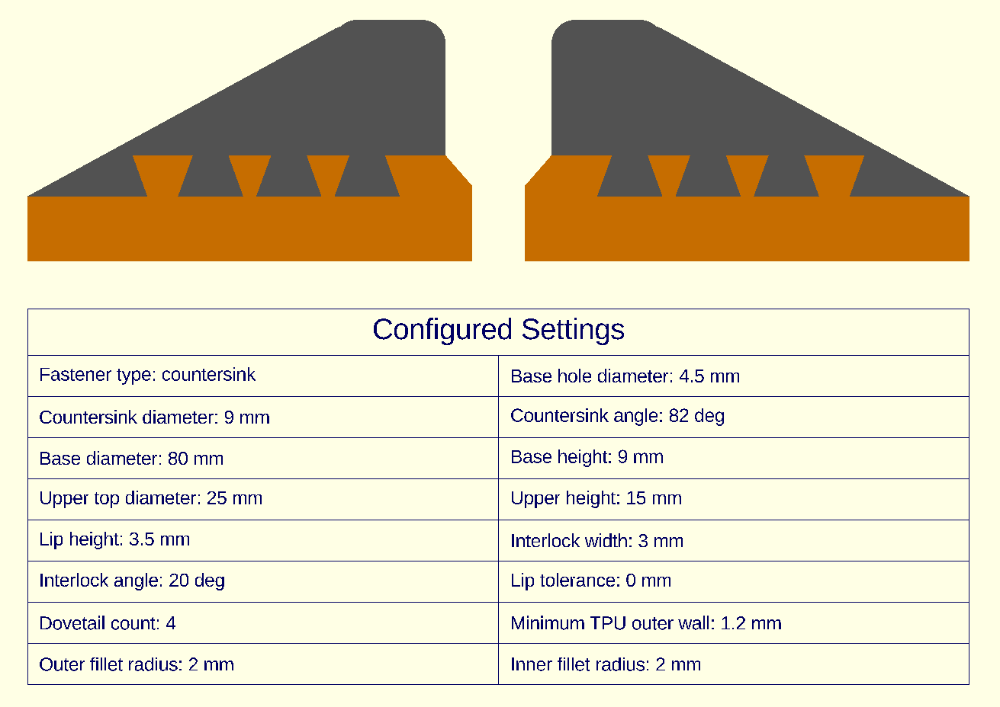
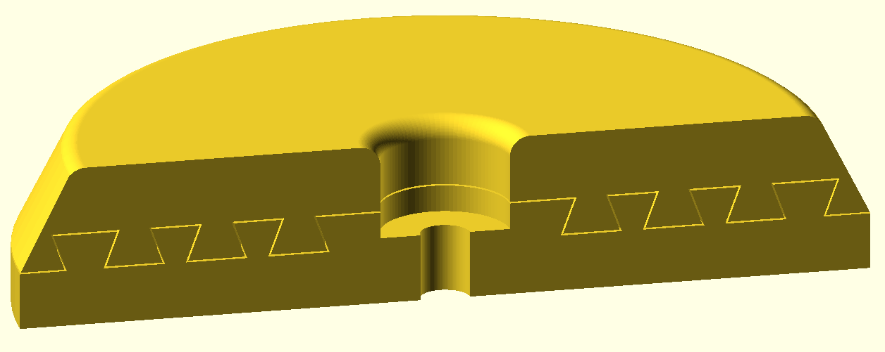
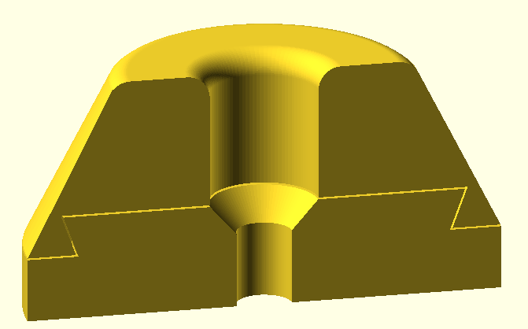

# Parametric Two-Material Screw-On Foot for Equipment, Furniture, etc.

Create a round, screw-mounted foot sized for your furniture, appliance, enclosure, or other equipment. The model consists of a rigid base and a tapered upper cushion that lock together mechanically (using annular dovetails), so no adhesive is required.

The intended combination is a rigid material such as PETG or PLA for the base and TPU for the upper. The rigid base helps spread the load and supports the fastener, while the TPU section provides grip, cushioning, and vibration isolation. If extra rigidity is not needed, the complete foot can be printed in any single material (typically TPU).

## Parametric design

`TwoMaterialEquipmentFoot_v3.scad` lets you customize:

- Overall base diameter and height
- Upper height and top diameter
- Screw clearance-hole diameter
- A countersink for a flat-head screw, including its diameter and angle
- A recessed pocket for a pan-head/round-head screw or washer
- Interlock width, height, angle, and fit tolerance
- One or multiple concentric dovetails
- Minimum TPU outer-wall thickness
- Inner and outer fillet radii

A typical customization process would be:

- Basic dimensions: Set the overall diameter of the base and the heights of both parts.
- Fastener Logic: Toggle between a tapered countersink (for flat-head wood or machine screws) or a washer/recess pocket (for pan-head screws).
- Interlock Controls: Tweak the interlock angle, height and number of dovetails to dictate how aggressive the undercuts are.
- Corner Fillets: Set the radius for both the inner and outer top edges of the TPU pad for a professional, rounded look.

The 2D Sketch, 3D Assembled, and 3D Cutaway views make it easy to inspect the generated geometry before exporting it. Built-in validation also catches parameter combinations that would make features overlap or leave the model too thin.

*The 2D Sketch view shows the revolved cross section used to generate the foot, along with the active customizable settings.*

## Mechanical dovetail interlock

The upper wraps around the outside of the rigid base and fills undercut, concentric dovetails. This captures the two components both radially and vertically. Set `dovetail_count` to **1** for a simple outer interlock, or increase it to add multiple concentric dovetails when the available dimensions permit.

*A customized cutaway with multiple dovetails. Additional concentric locks increase the interlocked interface between the base and upper.*

*The default settings use one dovetail. The two cutaway examples illustrate that the design supports either one or multiple interlocks.*

## Exporting and printing

### Two-material print

Choose **PETG only** and export the rigid base as an STL, then choose **TPU only** and export the upper as a second STL. Import both STLs into Bambu Studio as parts of the same object so they retain their shared position:

- Open the "prepare" tab in Bambu slicer, select both files simultaneously, and drag them into the workspace.
- When the slicer asks, "Load these files as a single object with multiple parts?", click YES. Because of the underlying OpenSCAD math, they will drop into place perfectly aligned.

In "Objects", assign the rigid base and flexible upper to their respective filaments. 

The default zero lip tolerance is intended for co-printing. Adjust the tolerance if your printer, materials, or preferred assembly method require additional clearance. As always, confirm that your chosen dimensions, material, infill, wall count, and fastener are suitable for the equipment load before use.

### One-material print

Choose **Full Assembly** when exporting.

### The included 3MF file

The included file `parametric_foot_assortment.3mf` is just an example. It prints the selection of fairly large feet that are shown in the 30-second video. You can use this file as a starting point for your own Bambu Studio settings, or just to observe how I sliced the project. I guess in principle you could print that plate four times (28 hours on an X2D) to get some complete sets of various sized feet, but I don't expect anyone to actually do that.

For normal real-world use cases, customize the parameters and export STL files.

## License & Acknowledgments

Designed using OpenSCAD. Free to modify, use, and share under the open-source community guidelines.
