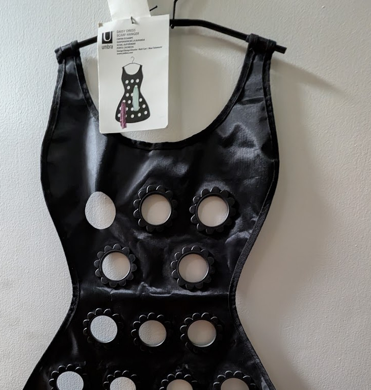
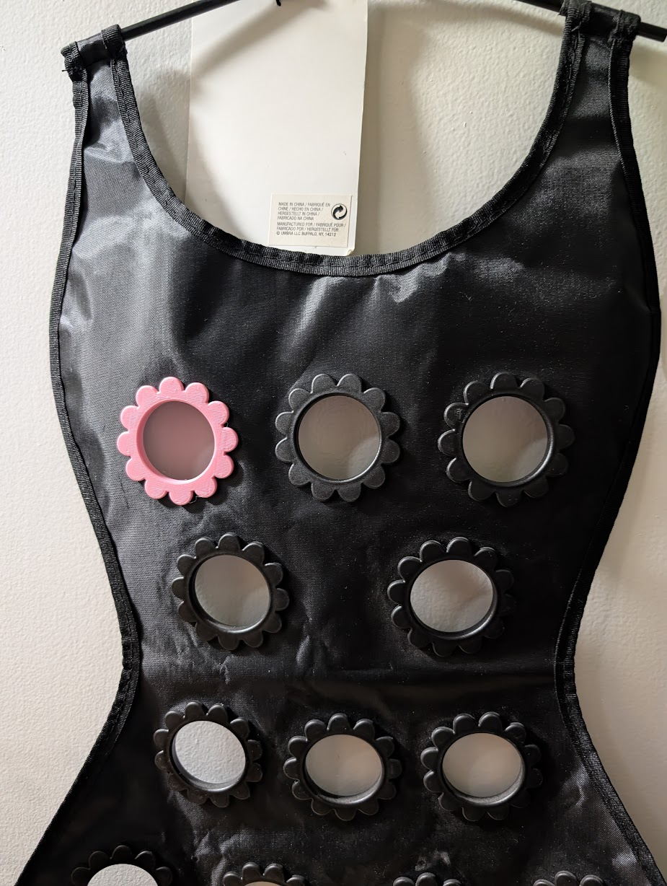
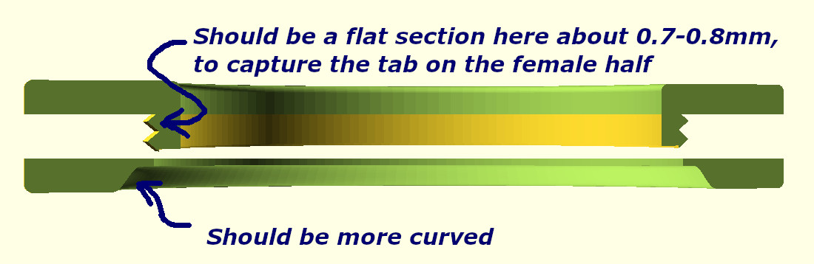

# Replacement flower for the Umbra Daisy Scarf Hanger

This scarf hanger was missing one of its flowers:

The project in this directory produces a replacement part for that missing flower. Here is the hanger with the replacement flower installed:

It works in spite of having some issues, illustrated here:

Also I would like to make it really easy to change the number and size of the petals. I printed it in pink PLA+ rather than black, the idea being:

* Two different blacks might be just different enough to look like a mistake
* The owner of the scarf hanger thought it might be nice to make it look like a brooch, so a contrasting colour is appropriate.
    * That's also why I might come back later and generate it with a smaller number of larger petals, to further differentiate it from the other flowers.
* PLA+ is more flexible than PLA, so there's less chance of it breaking while snapping the halves together. Note that the rings that snap together are pressed in the weakest possible direction, making separation of layers or filament passes likely.
    * An alternative would be PETG, but the only PETG spools I had on hand were black and clear.
