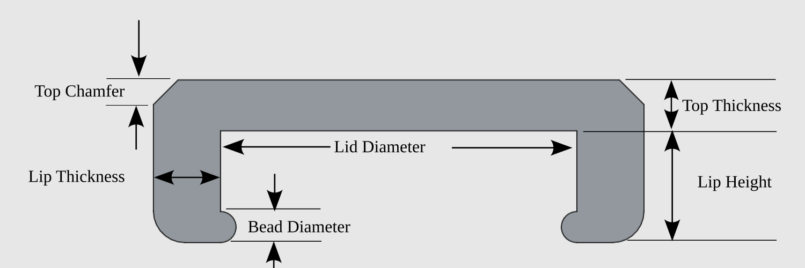
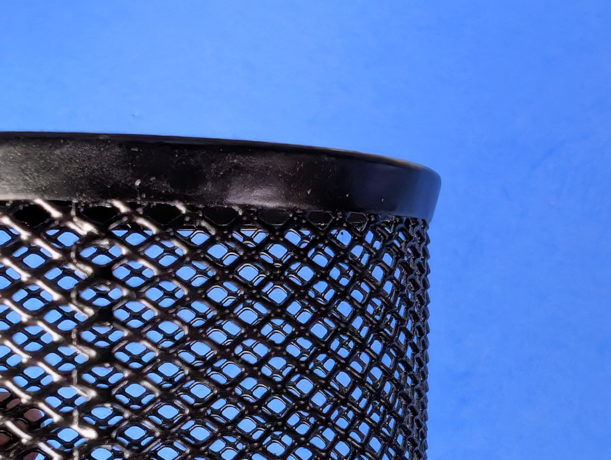
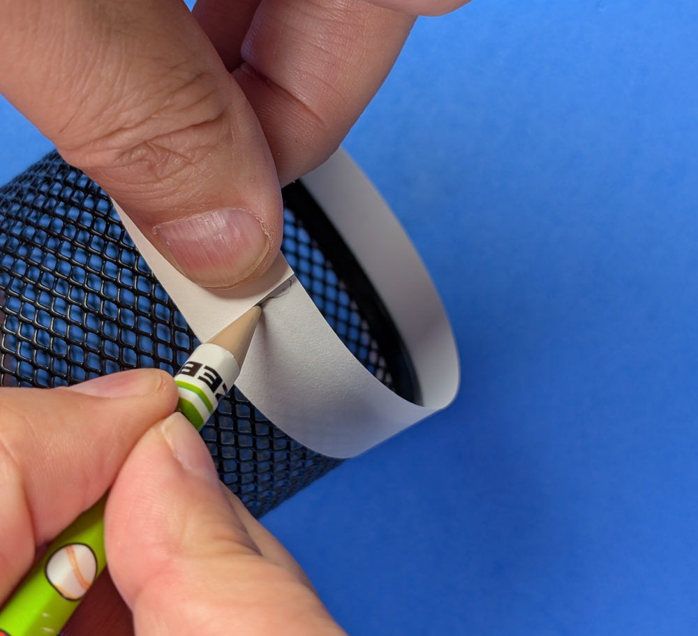
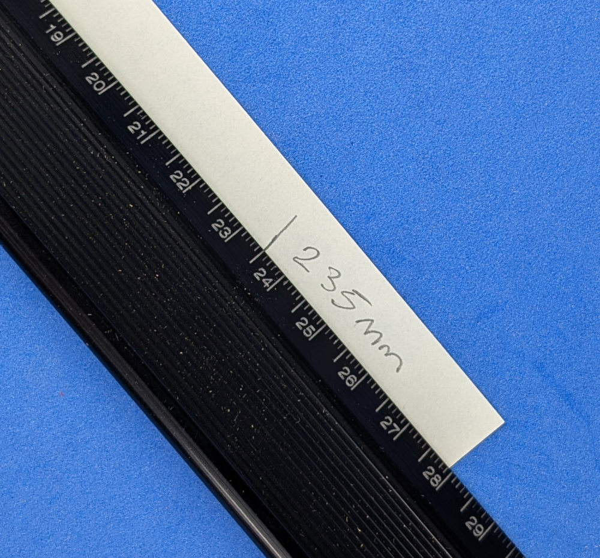
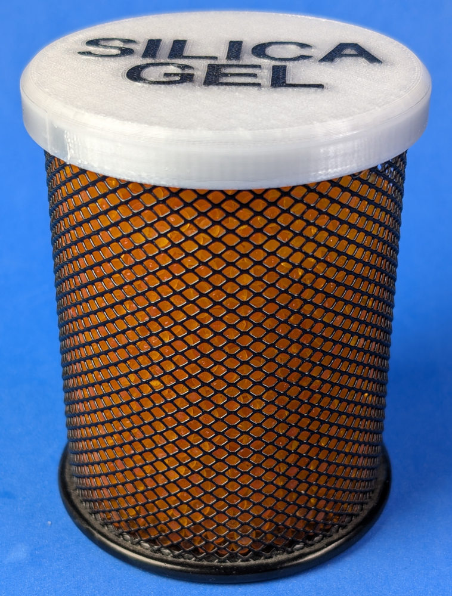
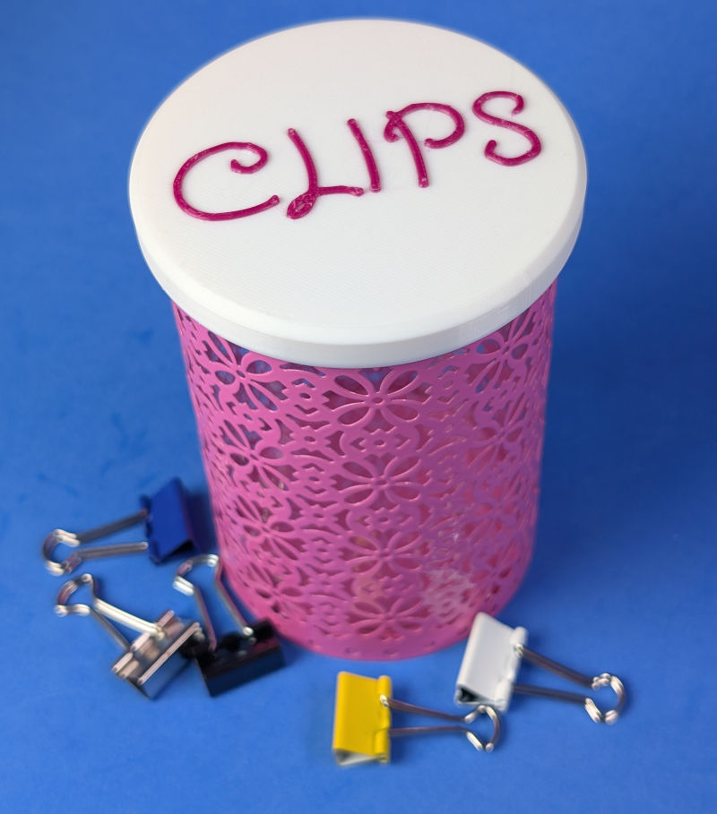

# Parametric Round Snap-On Lid with Optional Text

This model creates a custom round lid for a coffee can, tin, mug, pencil cup, storage container, or other cylindrical object. Enter the container diameter and the desired lid dimensions, then export a lid sized for your particular application.

You can optionally add text, which can be recessed, flush or proud, and which can optionally be printed with a different filament, normally of a different color.

The lid has an outer skirt and an optional half-round retaining bead on its inside edge. The bead is intended to pass over a rolled rim or similar feature and help the lid snap into place. Because printers, materials, and containers vary, expect to make a small test print or adjust the diameter before printing a large final lid.

## Parametric design

`ParametricRoundLid.scad` lets you customize:

- Lid diameter, measured without the outer lip
- Top thickness
- Outer lip thickness and height
- Diameter of the optional half-round retaining bead
- Chamfer around the upper edge
- Top-up or top-down print orientation
- Single-line or multiline text
- Typeface, style, and a custom installed font
- Text size as a percentage of the usable lid diameter
- Raised, flush, recessed, or full-depth lettering
- 2D sketch, complete model, lid-only, and lettering-only views
- Preview/export facet count (smoothness of circular features)

The model includes validation for dimensions that cannot produce workable geometry. Text is automatically scaled to remain within the selected circular area, including multiline labels and Unicode symbols supported by the selected font.



*Cross-section illustrating how each dimension parameter is used*

## Text and symbols

Set `text_lines` to one or more quoted strings. For example:

```scad
text_lines = ["COFFEE"];
text_lines = ["SILICA", "GEL"];
text_lines = ["COFFEE", "☕"];
```

The three Liberation font families are included as portable choices because they are commonly available with OpenSCAD. Select **Custom** to enter another installed font family. A Unicode symbol will only render if the selected font contains that glyph.

When customizing the design, you can obtain a list of available fonts as follows (unless they've changed the interface by the time you read these instructions):

- Click the "Code" button to view the OpenSCAD code
- At the bottom, beside the "Save" button, click the other button with an icon that looks like a magnifying glass and a letter T.
- A list of fonts appears. You can copy a font name to the clipboard.

You can enter just the family name in the custom typeface field and select its style separately. For example, for `Averia Serif Libre:style=Regular`, enter `Averia Serif Libre` and select **Normal**. Alternatively, paste the entire font name, including its `:style=...` suffix, and select **(none)** so that the script does not add another style suffix. A font name without a style suffix, such as `AR One Sans`, also works with **(none)**.

Lettering can be configured in several ways:

- Positive `text_height`: raised above the lid
- Zero `text_height`: flush with the top surface
- Negative `text_height`: recessed below the top surface
- `text_depth` equal to `top_thickness`: lettering passes through the complete top and appears reversed when viewed from inside

## Exporting and printing

### One-material print

Select **Single Part**, choose the desired print orientation, and export the complete model as an STL.

**Top Down** usually gives the cleanest unsupported top surface when the text is flush or recessed. The lower lip edge is rounded in this orientation. Raised text will require supports when printed top-down.

**Top Up** places the bottom of the lip on the build plate. This is useful for raised lettering, but the underside of the lid panel may require supports. One-eighth-circle transitions meet the outer lip walls tangentially and leave a flat contact area on the build plate.

### Two-material print

Select **Lid Only** and export the lid, then select **Lettering Only** and export the lettering as a second STL. The two files share the same origin and orientation:

1. Import both STL files into Bambu Studio at the same time.
2. When asked, load them as a single object with multiple parts.
3. Assign a different filament to each part.
4. Confirm the parts remain aligned before slicing.

The **Single Part** view previews the lid and lettering together in different colours. For a flush two-material label, use a positive `text_depth` and set `text_height` to zero. Use a negative `text_height` when the coloured lettering surface should sit below the lid surface.

## Fit and material considerations

- Measure the container in several places; thin cans and cups may not be perfectly round.
    - You can also wrap a strip of paper around the container and make a mark to measure the circumference (like taking a waist measurement). Divide by Pi and that's the diameter.
- Material shrinkage, extrusion width, and printer calibration all affect the final fit.
- PLA is easy to print but relatively rigid. PETG may provide a tougher and slightly more flexible snap lip. TPU is more flexible, allowing a tighter fit. Other materials can work if their properties suit the application.
- Start with a modest retaining bead and adjust it after a fit test. An overly large bead can make the lid difficult to install or remove.
- This model is not inherently airtight, watertight, or food-safe. Those properties depend on fit, material, printer, and post-processing.

## Example use case: mesh pencil-cup desiccant container

My inspiration for this project was that I wanted a container for silica gel desiccant. It seemed to me that a mesh pencil cup would allow plenty of air flow while properly retaining the beads. It just needed a lid, and as always I tried to make my design applicable to other use-cases.

The included `PencilCupLid75mm.3mf`, lid STL, and lettering STL are an example of this application, not a universal fit.

My process is documented here as an example of how to use the model.

The rim of the pencil cup is wider than the body, and slopes inward. I wanted the lid to snap over the wider part.



To obtain the diameters of the cup and the rim, I wrapped a piece of paper around the cup and made a mark corresponding to the circumference. Dividing that number by Pi will give us the diameter.



For the rim, the circumference was 235 mm, almost exactly. The main cylindrical section was almost exactly 230mm. These things seem to be sized by circumference rather than by diameter.



Those measurements work out to diameters of 74.8 mm and 73.2 mm, respectively. I was using PETG, which has a bit of give to it compared with PLA, but it's not as flexible as TPU. Here are the settings I used.

| Setting | Value used for the ~75mm pencil cup|
|---|---|
| print orientation | Top Down |
| lid diameter | 76 |
| top thickness | 2 |
| lip thickness | 2 |
| lip height | 7 |
| bead diameter | 2 |
| top chamfer | 1 |
| text lines | `["SILICA", "GEL"]` |
| text typeface | Liberation Sans |
| text style | Bold |
| text fit percent | 85 |
| text depth | 0.1 |
| text height | 1.3 |
| line spacing | 1.15 |
| facet count | 128 |

The inside diameter of the bead on the lip is 76-2=74 mm, which is 0.8mm less than the diameter of the rim on the cup and 0.8mm more than the diameter of the main cylinder of the cup. The main diameter is 76mm, which is a bit loose over the 74.8 mm rim. I don't claim any science was involved -- I just guessed at the appropriate numbers.

Here's the finished product. To my surprise, my first try worked. It's printed in clear/translucent PETG with black PETG lettering, using the two heads on my Bambu X2D printer.



## Another example: simple lid with custom typeface

My wife had a decorative jar that she uses to store small binder clips. I printed the lid in white PLA with purple raised lettering. There's no bead, so it just slides over the top, just slightly snug.



For the text, I downloaded the "Crafty Girls" font from [from fonts.google.com](https://fonts.google.com/specimen/Crafty+Girls), and installed it on my PC. I entered "Crafty Girls" as a custom typeface. That works if you're running OpenSCAD locally.

## Other possible uses

- Replacement lids for coffee cans and similar containers
- Covers for mugs or cylindrical storage cups
- Labelled workshop and craft-storage containers
- Dust covers for open-ended round objects
- Ventilated desiccant holders
- Colour-coded or symbol-labelled organization systems

## License & acknowledgments

Designed using OpenSCAD with coding help from [OpenAI Codex](https://openai.com/codex/). Feel free to customize, remix, and share according to the license attached to this model.

If you print this design, please share your make. I would enjoy seeing the containers, labels, symbols, materials, and parameter combinations people use.
