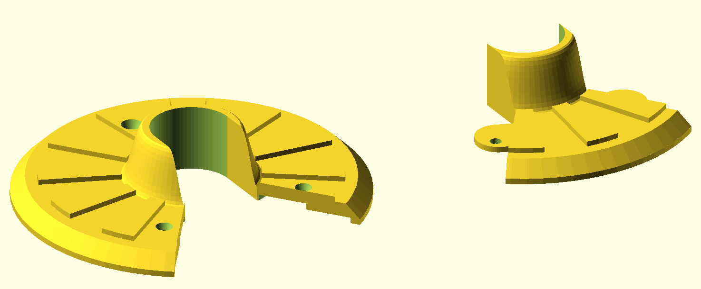
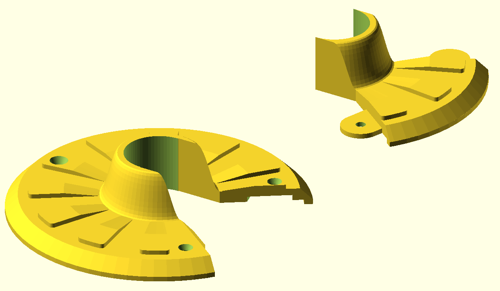
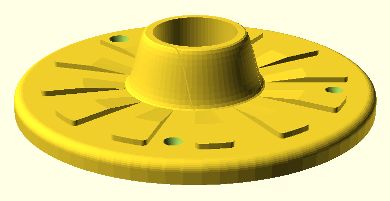
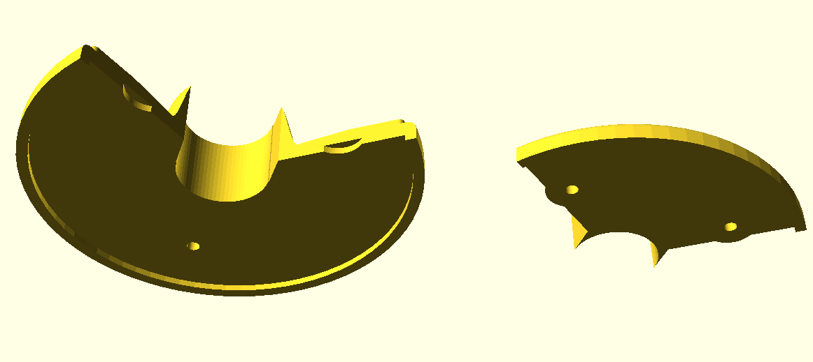
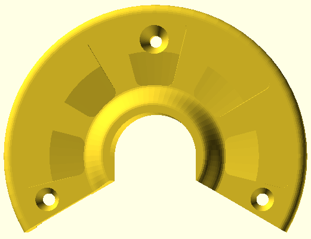
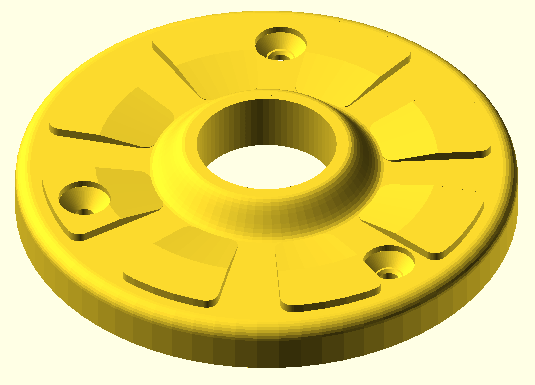

# Design process for the hose bib escutcheon

Here I am documenting how I did the design for the hose bib escutcheon. The way I see it, I designed the part and Codex wrote the code. This play-by-play may be an instructonal example for others who want to use Codex or other AI tools to help them with OpenSCAD design (showing either what to do or what not to do, depending on how you think I did).

## Initial commit

Using Visual Studio Code with the OpenAI Codex extension installed I started with an OpenSCAD file that was empty apart from the following comment:

```c++
// TODO: create an OpenSCAD script that generates a hose bib escutcheon with the following features:
// - Customizable parameters
// - The overall shape is circular, with a hole in the middle slightly larger than the diameter of the hose bib pipe
// - The front surface tapers toward the back surface and has a decorative pattern similar to flower petals, with the petals being raised and the spaces between them recessed
// - The back side has a rim slightly further back than the main flat back, the idea being that I can cut a piece of neoprene foam to fit inside the rim, and the rim will lie right against the wall on which it's mounted
// - Two parts are created: upper and lower
// - The upper part can be slid over the pipe, so the opening at the bottom for the lower part is 
// - The dividing lines between the parts, as viewed from the front, are along the edges of the petals, so that when the two parts are assembled, the dividing lines are hidden by the raised petals
// - The lower part extends under the upper part, which has grooves to accommodate that extension, and there are aligned screw holes in both parts so that when aligned a pair of screws can be used to hold both parts to the wall
// - Two additional screw holes are provided: one near the top of the upper part and one near the bottom of the lower part, for secure and stable mounting
// - All four screw holes are the same distance from the center of the escutcheon, and they are configurable to accept flat head or round head screws of different sizes
// - The design will be 3D printed with a raft and support, decorative side up
```

Then I clicked the "Impement with Codex" pop-up prompt. I could equally have entered that specification to Claude, Gemini, ChatGPT etc. on the web, asking for it to return a source file, or I could have used GitHub Copilot in Visual Studio Code to generate the code. I just happened to be trying out the OpenAI Codex extension at the time.

The result was my initial commit. It did a nice job:


# Revisions

I asked for the following changes:

- Eliminate the screw hole in the middle of the lower part, because the two other lower-half screws are sufficient.
- Add a sleeve in the middle, protruding upward by a customizable distance, with an S-shaped revolved profile. The sleeve surrounds the pipe and privdes an attractive interface between the escutcheon and the pipe.
- Modify the petals so that they start at the point where the sleeve becomes tangential to the main plate.
- Make the screw head stype and layout selections use selection lists
- Group the customizable parameters in sections
- At the top add a selectable setting model_view: "Upper part", "Lower part", "Assembled", "Side by side" to control which parts are visible in the 3D view and how they are positioned. When exporting the upper or lower part, the positioning should be as it is for "assembled", so that the two STL files can be imported into Bambu Studio and will be aligned correctly as a single part if someone is installing the escutcheon over a bare (possibly threaded) pipe, before installing the hose bib.

Result:


I see some issues:

- The petals have oddly sloped sides, which vary as you go around the circle. 
- I don't think we're guaranteed to be able to place the upper part over the pipe. Maybe lower_mask2d needs to include a section near the pipe with parallel sides, so that the minimum width of the channel is the same as the diameter of the center hole.
- If I increase the petal width, the petals protrude past the edge of main surface of the escutcheon.
- Let's make the cut line coincident with the edge of a petal, rather than the center of a petal, so that the join is less visible. Maybe something like:
    - find the points along the tangent line of the sleeve connection that are just wide enough to accommodate the pipe
    - find the inner or outer edges of petals that are closest to those points, but outside of them, and use those as the cut line. That way the cut line is along the edge of a petal, and the petals will be wide enough to cover the pipe.

Here's what I mean by the side slopes of the petals:

~[images/commit2_issue1.png](images/commit2_issue1.png)

Result:



Now I see these issues:

- The tabs are not centered on the screw holes, so they won't be as strong as they could be.
- The petals have become less decorative. Can we round off the end of each petal, concentric with the main circular plate, and further round off the outer corners, for example with a fillet?
- Can we also restore the tapering of the petals, so that they are zero-height at the inner end and thicker near the tip? Maybe just wedge the inner half of the petal, so that the outer half is still flat and wide, but the inner half tapers down to zero height at the base of the petal.
    - Let's make the outer-end thicknes a settable parameter.
- A sliver of the petal edge appears on each side of the slot in the upper part. Maybe the slot needs to be made just a hair wider?

I think this design is good enough that I'd be happy to use it now, although maybe some things could be rounded off or otherwise embelleshed, to be more decorative.



My next prompt was:

> In unsplit_escutcheon, instead of using cylinders, let's create a 2D sketch that includes the main curcular plate, the rim and the central sleeve, and then revolve that sketch to create the 3D shape. I think that will render more quickly, and it should also make it straightforward to round off the edge of the circular plate rather than making it angled.

That got me (when rendered -- preview no longer works):



For people who might want to create a single part and slide it over a pipe, I then prompted:

> Let's add a new model view "All in one", which is just like "Assembled" except that it doesn't create and assemble two parts (i.e., there's no cut line). Instead, it creates the entire design as a single part, intended to be printed as a single part and then slid over a pipe. Also, please add a one-line comment above every parameter describing what the parameter does.

I then made a slight tweak to one of the comments, but otherwise committed as-is. I didn't create an image, because that hasn't changed from the previous commit.

Then (pasting an image of the preview with default parameters, which is broken):

> Here is what the preview looks like with the default parameters. Rendering works fine, but in the preview a lot of objects are missing. Can we make the preview work without disturbing the rendering? The default model view is "Assembled", but the problem happens in all view modes. In every case only the screw holes and, if present, the tabs, are shown in the preview.

There were still some parts not previewing, so I prompted "More of it previews now, but not everything" with a pasted image, and that got me a preview that looks the same as the full render.

Then:

> Let's add some asserts for parameter combinations that will not render properly. One thing I notice is that if you make the petal outer radius too large the tip of the petal gets cut off at the edge of the flat part of the circular plate, so that would be one of the asserts. Please add whatever asserts you think are appropriate to prevent the user from entering parameter combinations that will not render properly.

At this point I started trying various combinations of parameters, to see if there were any parameter-specific ones. With all default values except `petal_outer_radius=56` (as high as it can go before asserting), the lower screw holes don't pass through both parts.



Next prompt:

> Testing combinations of settings, I noticed:
> 
> - The lower screw holes don't pass through both parts when `petal_outer_radius=56` with all other parameters at default. The lower screw holes need to always be in a part of the design that passes through the upper part as well as the tabs on the lower part.
> - With some combinations of parameters there is a thin sliver of the petal that appears on each side of the slot in the lower part
> - The slot_side_clearance setting affects the slot where it interacts with the sleeve. I think that's incorrect, and that it should affect the
> positioning of the angled part of the slot, which is next to a petal. With some combinations of settings I get a sliver of petal on each side of the
> lower part, and the setting doesn't help. There is no need for a setting to affect the slot where it interacts with the sleeve, because
> by definition the width of the center hole is the correct width for that part of the slot.

While configuring for my particular usage, I noticed that the size of the screw hole for a flat head screw varies depending on where it is relative to the petals:



Next prompt:

> I'd like to change how `screw_head_diameter` and `screw_head_height` work for flat head screws. Currently the diameter of the top of the screw hole is different, depending on whether the hole is on a petal vs the space between petals. For flat head screws, we can assume a countersink angle of 90 degrees (45 degree slopes). Knowing the shank and head diameters, based on that angle you can calculate the height of the countersink portion of the screw hole. We could redefine `screw_head_height` as screw_head_depth, and make it the depth of the allowance for the screw head below the highest surface perforated by the screw (the petal height or the flat space height), so for flat head screws `screw_head_height=0` means the head sits against the surface, and for flat head screws zero means the head of the screw is flush with the surface. I realize it could be tricky where you have the hole over the sloped part of a petal, so in that case it would be acceptable to use the full petal depth to define the height of the surface for the hole.

There was a bit of back-and-forth, but that feature is now working. In this image I have configured a flat-head screw hole with the head recessed 1.4mm:


