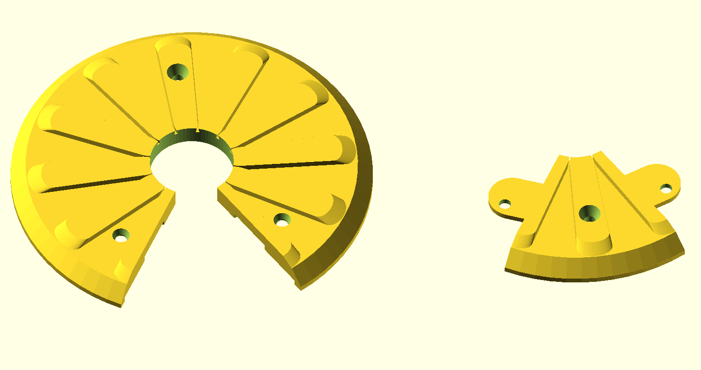
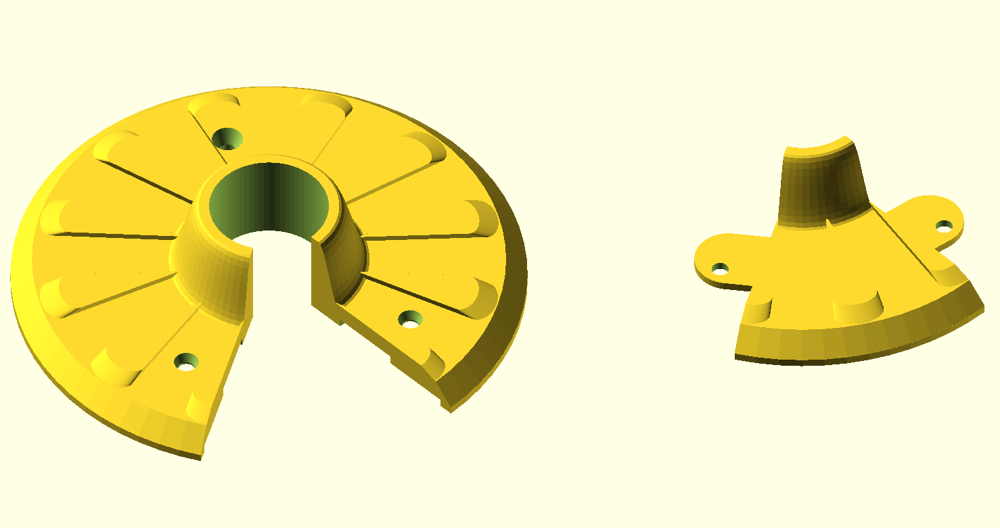

# Design process for the hose bib escutcheon

Here I am documenting how I did the design for the hose bib escutcheon. 

## Initial commit

Using Visual Studio Code with the OpenAI Codex extension installed I started with an OpenSCAD file that was empty apart from the following comment:

```c++
// TODO: create an OpenSCAD script that generates a hose bib escutcheon with the following features:
// - Customizable parameters
// - The overall shape is circular, with a hole in the middle slightly larger than the diameter of the hose bib pipe
// - The front surface tapers toward the back surface and has a decorative pattern similar to flower petals, with the petals being raised and the spaces between them recessed
// - The back side has a rim slightly further back than the main flat back, the idea being that I can cut a piece of neoprene foam to fit inside the rim, and the rim will lie right against the wall on which it's mounted
// - Two parts are created: upper and lower
// - The upper part can be slid over the pipe, so the opening at the bottom for the lower part is 
// - The dividing lines between the parts, as viewed from the front, are along the edges of the petals, so that when the two parts are assembled, the dividing lines are hidden by the raised petals
// - The lower part extends under the upper part, which has grooves to accommodate that extension, and there are aligned screw holes in both parts so that when aligned a pair of screws can be used to hold both parts to the wall
// - Two additional screw holes are provided: one near the top of the upper part and one near the bottom of the lower part, for secure and stable mounting
// - All four screw holes are the same distance from the center of the escutcheon, and they are configurable to accept flat head or round head screws of different sizes
// - The design will be 3D printed with a raft and support, decorative side up
```

Then I clicked the "Impement with Codex" pop-up prompt. I could equally have entered that specification to Claude, Gemini, ChatGPT etc. on the web, asking for it to return a source file, or I could have used GitHub Copilot in Visual Studio Code to generate the code. I just happened to be trying out the OpenAI Codex extension at the time.

The result was my initial commit. It did a nice job:



# Revisions

I asked for the following changes:

- Eliminate the screw hole in the middle of the lower part, because the two other lower-half screws are sufficient.
- Add a sleeve in the middle, protruding upward by a customizable distance, with an S-shaped revolved profile. The sleeve surrounds the pipe and privdes an attractive interface between the escutcheon and the pipe.
- Modify the petals so that they start at the point where the sleeve becomes tangential to the main plate.
- Make the screw head stype and layout selections use selection lists
- Group the customizable parameters in sections
- At the top add a selectable setting model_view: "Upper part", "Lower part", "Assembled", "Side by side" to control which parts are visible in the 3D view and how they are positioned. When exporting the upper or lower part, the positioning should be as it is for "assembled", so that the two STL files can be imported into Bambu Studio and will be aligned correctly as a single part if someone is installing the escutcheon over a bare (possibly threaded) pipe, before installing the hose bib.

Result:



